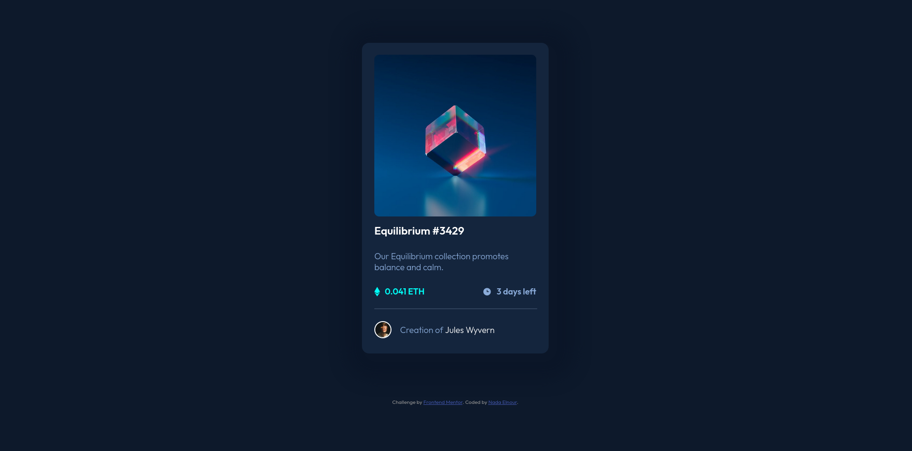

# Frontend Mentor - NFT preview card component solution

This is a solution to the [NFT preview card component challenge on Frontend Mentor](https://www.frontendmentor.io/challenges/nft-preview-card-component-SbdUL_w0U). Frontend Mentor challenges help you improve your coding skills by building realistic projects. 

## Table of contents

- [Overview](#overview)
  - [The challenge](#the-challenge)
  - [Screenshot](#screenshot)
  - [Links](#links)
- [My process](#my-process)
  - [Built with](#built-with)
  - [What I learned](#what-i-learned)
  - [Continued development](#continued-development)
  - [Useful resources](#useful-resources)
- [Author](#author)

## Overview

### The challenge

Users should be able to:

- View the optimal layout depending on their device's screen size
- See hover states for interactive elements

### Screenshot

### Links

- Solution URL: [here's GitHub repo](https://github.com/NElnour/nft-preview-component)
- Live Site URL: [here it is deployed on GitHub pages!](https://nelnour.github.io/nft-preview-component/)

## My process

### Built with

- Semantic HTML5 markup
- CSS custom properties
- Flexbox
- Firefox Dev Tools

### What I learned

Nesting fleboxes is a quick way of configuring element alignment. I haven't found discussions regarding limits to nesting (best practices or dev. experience-wise), but will keep looking!

## Author

- Website - [Nada Elnour](https://nelnour.github.io)
- Frontend Mentor - [@NElnour](https://www.frontendmentor.io/profile/NElnour)
